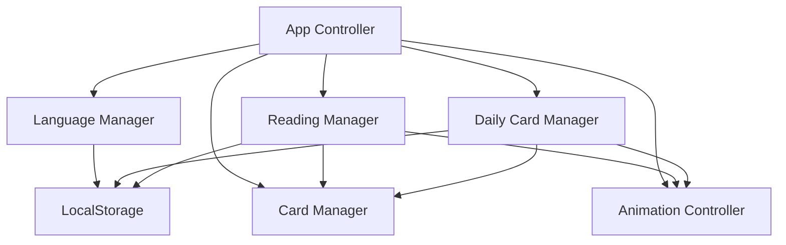

# Design Document - Whispering Arcana Tarot App

## Overview

Whispering Arcana is a single-file, front-end Tarot web application that creates a "digital spiritual sanctuary" experience. The application provides two core features: a formless reading system (1-9 cards) and an interactive daily card feature. The design emphasizes modern mysticism, fluid interactivity, and complete self-containment without external dependencies.

**Key Design Principles:**
- Single HTML file architecture for maximum portability
- Immersive "Silent Night, Modern Mysticism, Cosmic Dust" aesthetic
- Fluid 3D animations and smooth transitions
- Multi-language support (English/Traditional Chinese)
- Persistent user state management

## Architecture

### Single-File Architecture

**Design Decision:** All code, styles, and content are embedded within a single HTML file to ensure complete portability and eliminate dependency management.

**Rationale:** This approach provides users with a truly self-contained spiritual experience that can be saved locally, shared easily, and accessed without internet connectivity after initial download.

```
index.html
├── <head>
│   ├── Embedded CSS (all styles)
│   └── Meta tags and configuration
├── <body>
│   ├── Application structure
│   ├── Language switching UI
│   └── Main content areas
└── <script>
    ├── Application logic
    ├── Animation controllers
    ├── State management
    ├── Language system
    └── Tarot card data
```

### State Management Architecture

**Design Decision:** Use localStorage for persistence with a centralized state management pattern.

**Rationale:** localStorage provides reliable persistence for daily cards and user preferences while maintaining the single-file constraint. Centralized state management ensures consistent data flow.

```javascript
AppState = {
  currentLanguage: 'en' | 'zh-TW',
  dailyCard: {
    date: string,
    cardId: number,
    revealed: boolean
  },
  currentReading: {
    cards: Array<CardData>,
    revealed: Array<boolean>
  }
}
```

## Components and Interfaces

### Core Components

#### 1. Language System
- **Purpose:** Manage bilingual content and user language preferences
- **Interface:** `LanguageManager`
- **Key Methods:**
  - `setLanguage(lang: string)`
  - `getText(key: string): string`
  - `loadLanguageData()`

#### 2. Card Manager
- **Purpose:** Handle Tarot card data, selection, and interpretation logic
- **Interface:** `CardManager`
- **Key Methods:**
  - `getRandomCard(): CardData`
  - `getCardInterpretation(cardId: number, context: string): Interpretation`
  - `shuffleDeck(): Array<CardData>`

#### 3. Animation Controller
- **Purpose:** Manage 3D card flip animations and UI transitions
- **Interface:** `AnimationController`
- **Key Methods:**
  - `flipCard(element: HTMLElement, onComplete: Function)`
  - `arrangeCards(cards: Array<HTMLElement>, layout: string)`
  - `startBackgroundEffects()`

#### 4. Reading Manager
- **Purpose:** Orchestrate formless reading sessions
- **Interface:** `ReadingManager`
- **Key Methods:**
  - `startReading(cardCount: number)`
  - `revealCard(cardIndex: number)`
  - `completeReading()`

#### 5. Daily Card Manager
- **Purpose:** Handle daily card logic and persistence
- **Interface:** `DailyCardManager`
- **Key Methods:**
  - `checkDailyCard(): boolean`
  - `drawDailyCard(): CardData`
  - `getDailyInterpretation(): DailyInterpretation`

### Component Interactions



## Data Models

### Card Data Structure

```javascript
CardData = {
  id: number,           // 0-77 for full Tarot deck
  name: {
    en: string,
    'zh-TW': string
  },
  keywords: {
    en: Array<string>,
    'zh-TW': Array<string>
  },
  interpretation: {
    en: string,
    'zh-TW': string
  },
  dailyInterpretation: {
    en: {
      bodyAwareness: string,
      mindEmotion: string,
      spiritualGrowth: string
    },
    'zh-TW': {
      bodyAwareness: string,
      mindEmotion: string,
      spiritualGrowth: string
    }
  },
  imageUrl: string      // Base64 encoded or CSS-generated card image
}
```

### Language Content Structure

```javascript
LanguageContent = {
  en: {
    ui: {
      title: string,
      dailyCard: string,
      formlessReading: string,
      // ... all UI text
    },
    cards: {
      [cardId]: CardData
    }
  },
  'zh-TW': {
    // Mirror structure for Traditional Chinese
  }
}
```

### Persistent State Structure

```javascript
PersistentState = {
  language: 'en' | 'zh-TW',
  dailyCard: {
    date: string,        // ISO date string
    cardId: number,
    revealed: boolean
  },
  preferences: {
    reducedMotion: boolean
  }
}
```

## Visual Design System

### Color Palette
- **Primary Background:** Deep Night Blue (#0B0C2A)
- **Text Color:** Cream White (#F5F0E6)
- **Accent Color:** Matte Gold (#C8A97E)
- **Card Background:** Subtle gradient from #1A1B3A to #0B0C2A

### Typography
- **Headings:** Playfair Display (Google Fonts CDN)
- **Body Text:** Inter (Google Fonts CDN)
- **Fallbacks:** serif for headings, sans-serif for body

### Animation Design

**3D Card Flip Animation:**
```css
.card-flip {
  transform-style: preserve-3d;
  transition: transform 0.8s cubic-bezier(0.4, 0.0, 0.2, 1);
}

.card-flip.flipped {
  transform: rotateY(180deg);
}
```

**Background Effects:**
- Subtle floating particles using CSS animations
- Gentle pulsing glow effects on interactive elements
- Smooth fade transitions between application states

### Responsive Layout

**Design Decision:** Mobile-first responsive design with breakpoints at 768px and 1024px.

**Rationale:** Ensures optimal experience across all devices while maintaining the mystical aesthetic.

- **Mobile (< 768px):** Single column layout, larger touch targets
- **Tablet (768px - 1024px):** Optimized card arrangements, adjusted spacing
- **Desktop (> 1024px):** Full layout with enhanced visual effects

## Error Handling

### LocalStorage Failures
- **Strategy:** Graceful degradation with in-memory fallback
- **Implementation:** Try-catch blocks around all localStorage operations
- **User Experience:** Application continues to function without persistence

### Animation Performance Issues
- **Strategy:** Detect performance capabilities and adjust effects
- **Implementation:** Monitor frame rates and disable complex animations if needed
- **User Experience:** Respect `prefers-reduced-motion` media query

### Language Loading Failures
- **Strategy:** Default to English with error logging
- **Implementation:** Fallback language content embedded in application
- **User Experience:** Seamless fallback without user notification

### Card Data Corruption
- **Strategy:** Validate card data on load and regenerate if corrupted
- **Implementation:** Schema validation for all card-related data
- **User Experience:** Automatic recovery without user intervention

## Testing Strategy

### Unit Testing Approach
- **Language System:** Test all text retrieval and language switching
- **Card Logic:** Verify random selection, interpretation retrieval
- **State Management:** Test localStorage operations and fallbacks
- **Animation System:** Test animation triggers and completion callbacks

### Integration Testing
- **Daily Card Flow:** Complete daily card selection and persistence cycle
- **Formless Reading Flow:** End-to-end reading experience with multiple cards
- **Language Switching:** Verify all content updates correctly across languages

### Cross-Browser Testing
- **Target Browsers:** Chrome, Firefox, Safari, Edge (latest 2 versions)
- **Mobile Testing:** iOS Safari, Chrome Mobile, Samsung Internet
- **Feature Testing:** CSS animations, localStorage, responsive design

### Performance Testing
- **Animation Performance:** 60fps target for all animations
- **Load Time:** Sub-2-second initial load target
- **Memory Usage:** Monitor for memory leaks during extended use

### Accessibility Testing
- **Keyboard Navigation:** All interactive elements accessible via keyboard
- **Screen Reader:** ARIA labels for all dynamic content
- **Color Contrast:** WCAG AA compliance for all text
- **Motion Sensitivity:** Respect `prefers-reduced-motion` settings

## Security Considerations

### Content Security Policy
- **Inline Scripts:** Required for single-file architecture
- **External Resources:** Limited to Google Fonts CDN only
- **Data Storage:** Only localStorage, no external data transmission

### Data Privacy
- **Local Storage Only:** No data leaves the user's device
- **No Analytics:** No tracking or data collection
- **No External APIs:** Complete offline functionality after initial load

This design provides a comprehensive foundation for implementing the Whispering Arcana Tarot application while addressing all requirements and maintaining the mystical, self-contained experience the user envisions.